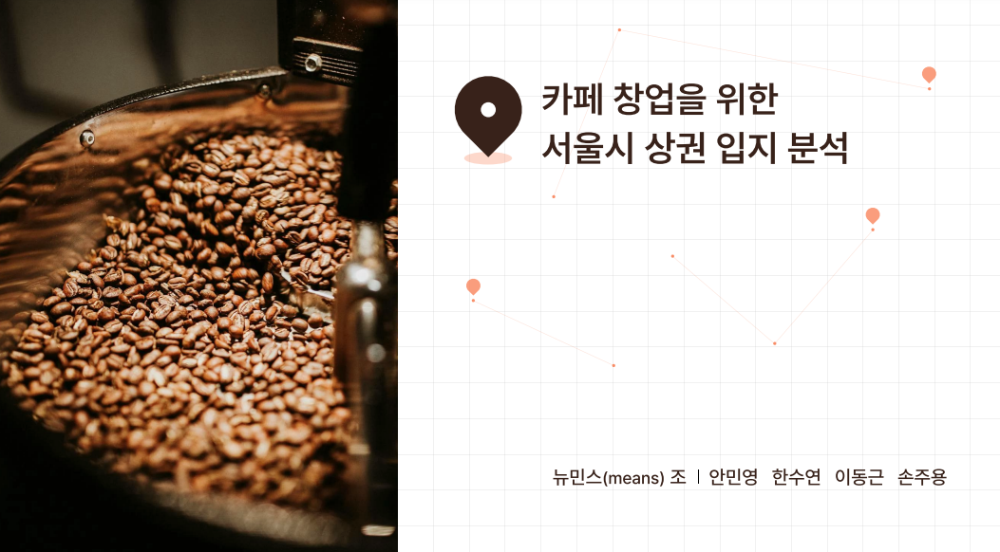
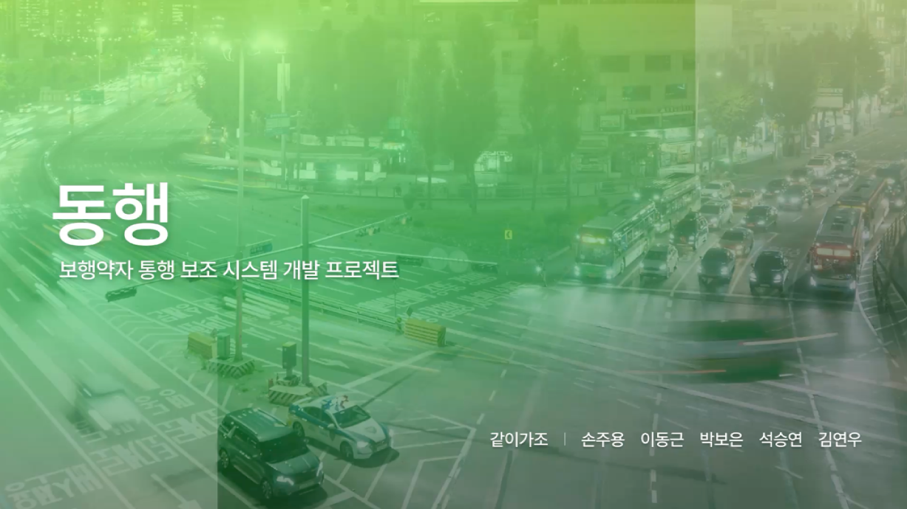

# Portfolio Projects

## Projects Overview

|    |
|:----------------------------------------------------------------:|
| **Project 1**  해외여행객 수 추이 분석 및 예측                 |

| .pdf) |
|:-----------------------------------------------------------------------:|
| **Project 2**  카페 창업을 위한 서울시 상권 입지 분석                 | 

| .pdf)        |
|:----------------------------------------------------------------------:|
| **Project 3**  보행약자 통행 보조 시스템 개발                        | 

## Learning Content

Click the thumbnail above to watch the video on YouTube: **"Title of the Video"**.
